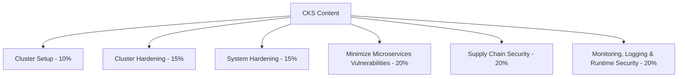
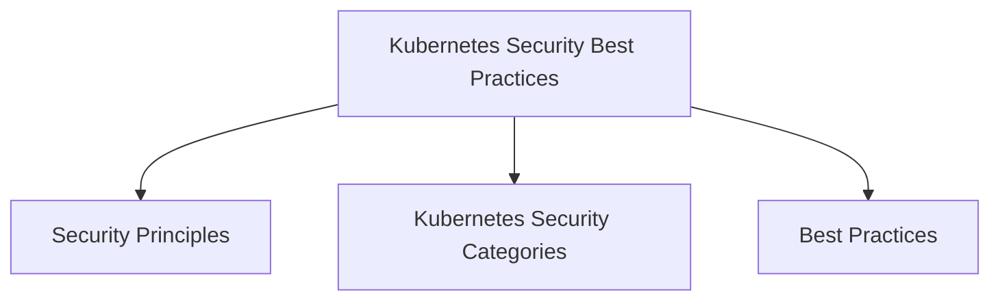
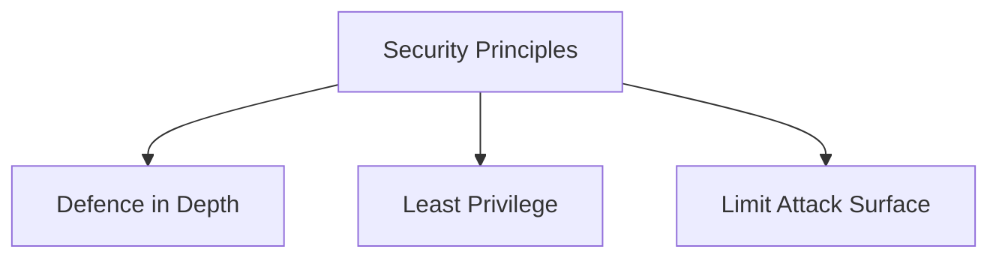
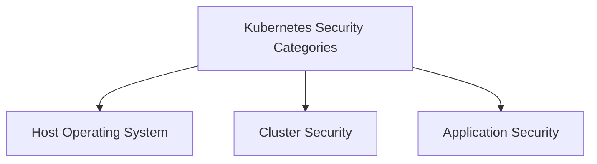
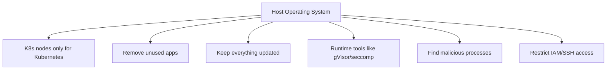
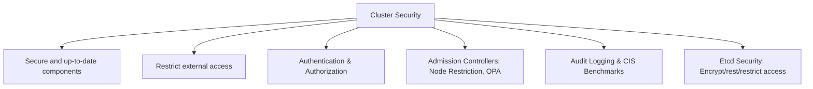
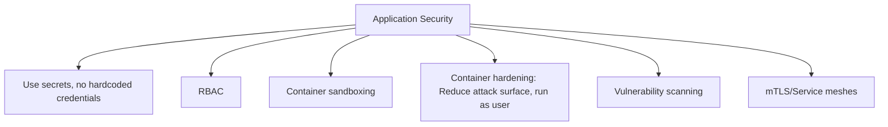
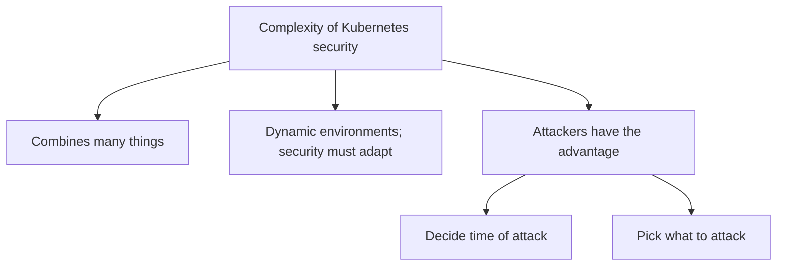

# Kubernetes Security and CKS Content

## 1. CKS Content

---

## 2. Kubernetes Security Best Practices

---

## 3. Security Principles

---

## 4. Kubernetes Security Categories

---

## 5. Kubernetes Best Practices
### Host Operating System

### Kubernetes Cluster Security

### Application Security

---

## 6. Complexity of Kubernetes Security

